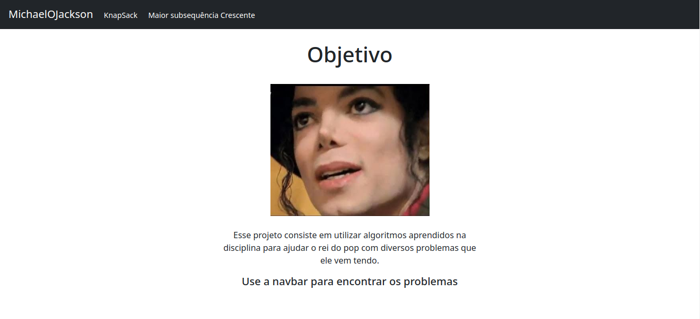
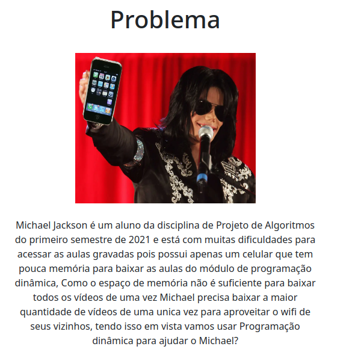
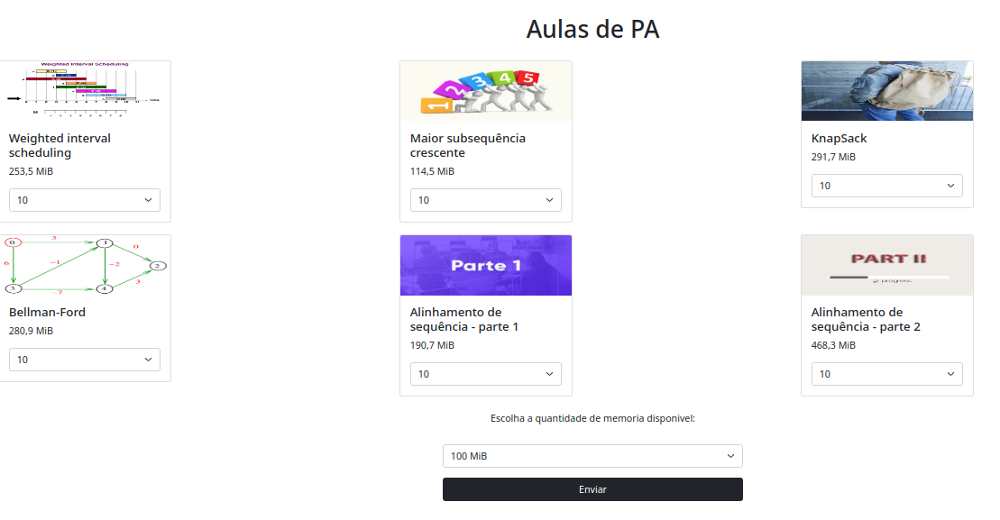
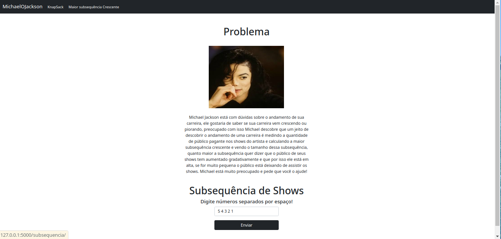

# PD_MichaelOJackson

**Número da Lista**: X 
**Conteúdo da Disciplina**: Programação Dinâmica 

## Alunos
|Matrícula | Aluno |
| -- | -- |
| 18/0106970  |  Matheus Gabriel Alves Rodrigues |
| 18/0129287 |  Pedro Henrique Vieira Lima |

## Sobre 
Esse projeto consiste em utilizar algoritmos aprendidos na disciplina para ajudar o rei do pop com 
diversos problemas que ele vem tendo.

## Screenshots
### Print 1

### Print 2

### Print 3

### Print 4

## Instalação 
**Linguagem**: Python 
**Framework**: Flask 

## Uso 

#### Instale o Flask
`pip install flask`

#### Execute a main da aplicação
`python src/main.py`

#### Acesse a aplicação
[http://127.0.0.1:5000/](http://127.0.0.1:5000/)

